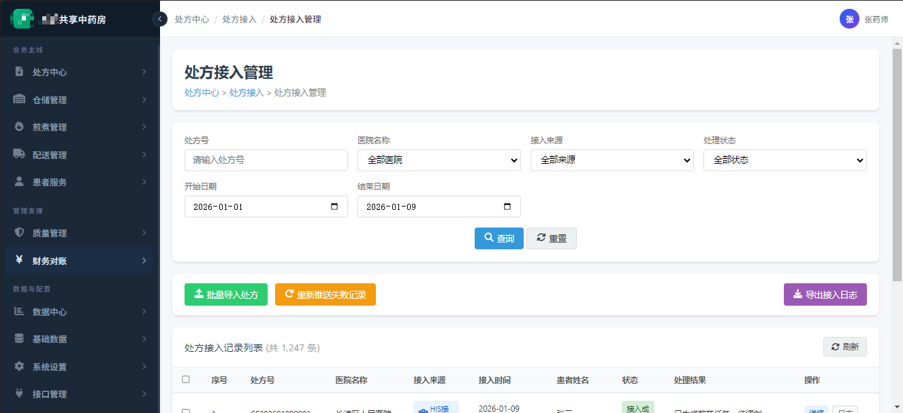
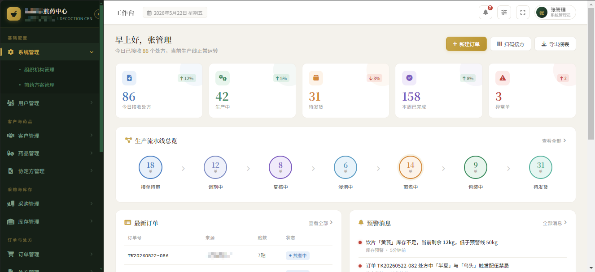
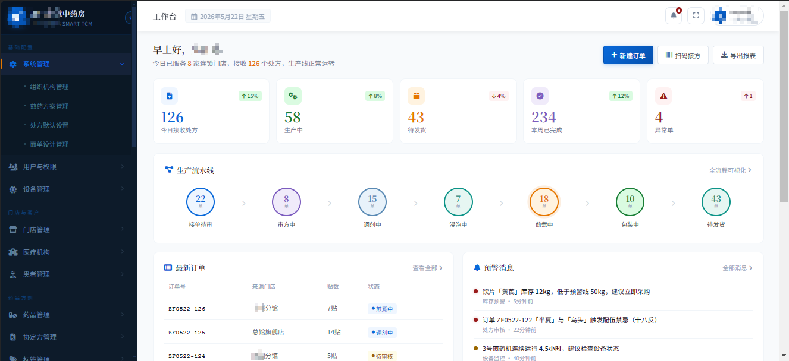
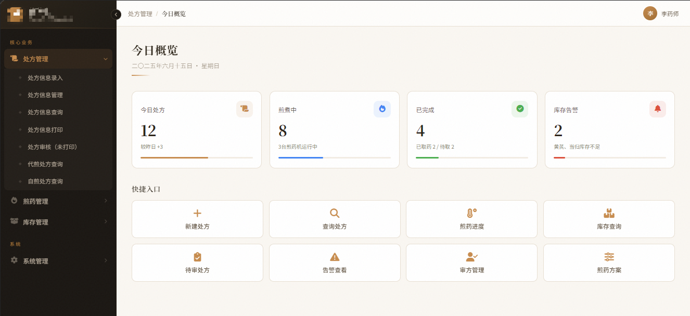

# OpenYGT-DMS 智能煎药管理系统

中文 | [English](README_EN.md)

[](LICENSE)
[]()
[]()
[]()
[]()

面向中药房汤剂煎煮场景的全流程智能管理系统，覆盖从处方接收到患者取药的完整链路。

> 系统内置设备物联网对接能力，支持煎药机、包装机、标签打印机等设备的实时监控与智能调度。

---

## 🚀 Demo 在线体验

| 项目 | 地址 |
|------|------|
| 🌐 演示站点 | https://demo.dms.openygt.org.cn |
| 💬 体验账号 | 请微信联系 `openygt` 获取账号与密码 |

> 演示数据每日凌晨自动重置，如需体验请添加微信 `openygt` 申请试用账号。

### 主要功能预览

| 模块 | 功能说明 |
|------|----------|
| 📋 处方管理 | 处方录入、接收、审核、流转全流程 |
| 🏭 生产指挥 | 生产看板、任务分配、流程跟踪、时效监控 |
| 🔧 设备管理 | 设备台账、联网监控、分组配对、告警中心 |
| ✅ 质量检验 | 质检记录、留样管理、合格统计 |
| 📦 发药管理 | 成品暂存、发药确认、患者进度查询 |
| 🔍 追溯查询 | 处方追溯、批次追溯、异常追溯 |
| 📱 PDA 作业 | 移动端煎药操作与设备识别 |
| 🖨️ 打印中心 | 标签打印、工单打印管理 |
| ⚙️ 系统管理 | 用户、角色、菜单、权限、参数配置 |

---

## 📦 快速开始

### 方式一：Docker 一键部署（推荐 ⭐）

> 适合：想最快体验系统的用户，无需安装 JDK、Node.js、MySQL
>
> 支持：Windows、macOS、Linux

**前置要求**
- [Docker](https://www.docker.com/products/docker-desktop) 20.10+
- [Docker Compose](https://docs.docker.com/compose/install/) 2.0+

**安装步骤**

```bash
# 1. 克隆仓库
git clone https://gitee.com/openygt/openygt-dms.git
cd openygt-dms

# 2. 设置 JWT 密钥（至少 32 位随机字符串，不能包含 "Test"）
export JWT_SECRET="YourRandomSecretKeyAtLeast32CharactersLong"

# 3. 启动全部服务（MySQL + Redis + 后端 + 前端）
docker compose up -d

# 4. 等待服务就绪（首次启动约 60-90 秒）
docker compose logs -f backend

# 5. 访问系统
# Web 管理端：http://localhost
# 默认账号：admin / admin123
```

> **Windows 用户注意**：`export` 命令请替换为 `set JWT_SECRET=你的密钥`

**常用命令**

```bash
# 查看服务状态
docker compose ps

# 查看日志
docker compose logs -f backend
docker compose logs -f frontend

# 停止服务
docker compose down

# 完全清理（包括数据库数据）
docker compose down -v
```

---

### 方式二：源码安装

> 适合：开发者、需要二次定制、想深入了解系统的用户

#### 前置环境

| 组件 | 版本要求 | 下载地址 |
|------|---------|----------|
| JDK | 8+ | [Oracle](https://www.oracle.com/java/technologies/downloads/) / [OpenJDK](https://adoptium.net/) |
| Node.js | 18+ | [nodejs.org](https://nodejs.org/) |
| MySQL | 8.0+ | [mysql.com](https://dev.mysql.com/downloads/) |
| Redis | 7+ | [redis.io](https://redis.io/download/) |
| Maven | 3.8+ | [maven.apache.org](https://maven.apache.org/download.cgi) |

#### 第一步：配置后端

```bash
# 1. 克隆仓库
git clone https://gitee.com/openygt/openygt-dms.git
cd openygt-dms

# 2. 复制示例配置文件
cp dms-app/src/main/resources/application.yml.example \
   dms-app/src/main/resources/application.yml

# 3. 编辑 application.yml，修改以下配置：
#    - spring.datasource.password: 你的 MySQL 密码
#    - spring.redis.password: 你的 Redis 密码（如无密码可留空）
#    - jwt.secret: 至少 32 位的随机字符串（不能包含 "Test"）
```

#### 第二步：创建数据库

```bash
# 使用 MySQL 客户端创建数据库
mysql -uroot -p -e "CREATE DATABASE openygt_dms CHARACTER SET utf8mb4 COLLATE utf8mb4_unicode_ci;"
```

#### 第三步：启动后端

```bash
# 编译后端
mvn clean package -DskipTests

# 设置环境变量并启动
export JWT_SECRET="YourRandomSecretKeyAtLeast32CharactersLong"
java -jar dms-app/target/dms-app-1.0.0.jar --server.port=8080
```

启动后，Flyway 会自动运行 `db/migration/` 下的 SQL 脚本创建表结构。

> 看到 `Started DmsApplication` 即表示启动成功。

#### 第四步：导入演示数据（可选）

```bash
# 导入演示数据，方便体验完整功能
mysql -uroot -p openygt_dms < dms-app/src/main/resources/db/demo/init.sql
```

#### 第五步：启动前端

```bash
# 新开一个终端窗口
cd frontend
npm install
npm run dev
```

#### 第六步：访问系统

打开浏览器访问：http://localhost:5173

默认账号：`admin` / `admin123`

> **Windows 用户**：命令中的 `export` 请替换为 `set`

---

## 🏗️ 项目结构

```
openygt-dms/
├── dms-analytics/          # 数据分析模块
├── dms-app/                # 应用启动入口
│   └── src/main/resources/
│       ├── db/migration/   # Flyway 数据库迁移脚本
│       └── db/demo/        # 演示数据
├── dms-common/             # 公共模块（工具类、常量）
├── dms-equipment/          # 设备管理模块
├── dms-inventory/          # 库存管理模块
├── dms-iot-gateway/        # IoT 网关模块
├── dms-masterdata/         # 主数据模块
├── dms-pda/                # PDA 移动端
├── dms-print/              # 打印中心模块
├── dms-production/         # 生产管理模块
├── dms-quality/            # 质量检验模块
├── dms-rbac/               # 权限控制模块
├── dms-system/             # 系统管理模块
├── frontend/               # Web 前端（Vue 3 + Vite）
│   └── src/
│       ├── api/            # API 接口
│       ├── views/          # 页面组件
│       └── router/         # 路由配置
├── pda-uniapp/             # PDA 移动端（uni-app）
├── docker-compose.yml      # Docker 一键部署配置
├── Dockerfile.backend      # 后端镜像构建
└── frontend/Dockerfile.frontend  # 前端镜像构建
```

---

## 🛠️ 技术栈

| 层级 | 技术选型 | 版本 |
|------|----------|------|
| 前端（Web） | Vue 3 + TypeScript + Element Plus | Vue 3.4 |
| 前端（PDA） | uni-app（Vue 3） | — |
| 后端 | Spring Boot + MyBatis-Plus | Spring Boot 2.7.18 |
| 数据库 | MySQL | 8.0+ |
| 缓存 | Redis | 7+ |
| 消息 | MQTT | — |
| 构建 | Maven | 3.8+ |
| 部署 | Docker + Docker Compose | 20.10+ |

---

## 📖 文档

- **用户手册 & 部署指南** → [openygt-docs](https://gitee.com/openygt/openygt-docs)
- **在线阅读** → https://openygt.org.cn/docs
- **架构设计** → [ARCHITECTURE.md](./ARCHITECTURE.md)

---

## 🏥 成功案例

### 案例一：某医共体共享中药房

> 某县域医共体统一建设共享中药房，为辖区内 8 家乡镇卫生院、2 家社区卫生服务中心提供集中煎药与配送服务，日处理处方峰值 300+ 张。

**系统主界面**



**核心功能模块（二级）**

- **处方中心**：处方接入、处方审核、我的处方、协定方管理
- **仓储管理**：供应商管理、入库管理、库存管理、药品效期管理、出库调拨、盘点养护、退货报损、包材管理
- **煎煮管理**：煎煮方案、生产任务、工序记录、设备管理
- **配送管理**：物流配送、院内发药、院内配送
- **患者服务**：处方查询、物流查询、微信公众号、工单/客服系统
- **质量管理**：工序质控、投诉管理、异常处方、药品召回管理
- **财务对账**：价格体系、药品调价、代煎费管理、对账管理
- **数据中心**：大屏管理、统计查询、报表中心
- **基础数据**：机构人员、药品管理、培训管理、标签面单、后台设置
- **系统设置**：权限管理、消息通知中心、处方提示、默认参数
- **接口管理**：处方接口、价格接口、库存接口、物流接口、设备接口

---

### 案例二：某第三方煎药中心

> 某市同康堂煎药中心，面向多家医院与诊所提供代煎代配服务，日处理处方峰值 200+ 张，覆盖接单、调剂、煎煮、包装、发货全流水线。

**系统主界面**



**核心功能模块（二级）**

- **基础配置**：组织机构管理、煎药方案管理、用户与权限管理
- **客户与药品**：客户管理、本厂/客户药品管理、药品匹配、配伍禁忌、协定方管理
- **采购与库存**：供应商管理、采购订单/审核、仓库管理、入库/出库管理、库存盘点/预警、报损报溢
- **订单与处方**：今日/历史订单、进度总览、异常处理、接方审核、协定方查询、处方回收站
- **煎药生产**：调剂管理、复核管理、泡药管理、煎药管理、包装管理、发货管理
- **中心监控**：机器管理/监控、货架管理/上架、发药管理
- **物流与患者**：物流信息、配送记录、患者信息管理
- **经营管理**：费用设置、账单/结算/对账管理
- **质量追溯**：煎药记录追溯、留样管理、操作日志、客户投诉
- **对外接口**：HIS 对接管理、API 管理、接口日志、数据同步状态
- **报表管理**：药品分类报表、处方贴数报表、工作量报表、客户订单统计、代煎效率报表、结算对账报表

---

### 案例三：某连锁中医馆中药房

> 某连锁中医品牌旗下 8 家门店共用一套煎药中心，日处理处方峰值 150+ 张，支持多门店订单聚合、统一调剂煎煮、按门店分批发货。

**系统主界面**



**核心功能模块（二级）**

- **系统管理**：组织机构管理、煎药方案管理、处方默认设置、面单设计管理
- **用户与权限**：用户管理、角色权限分配
- **设备管理**：煎药机/包装机档案、设备监控、维护计划
- **门店管理**：多门店订单汇聚、门店独立对账、分批发货
- **医疗机构**：合作医院/诊所管理、服务协议、客户账户
- **患者管理**：患者信息、历史处方、用药追溯
- **药品管理**：本厂/门店药品管理、库存预警、药品匹配、配伍禁忌
- **协定方管理**：协定方设置、版本控制、门店共享
- **标签管理**：标签模板、面单设计、条码打印
- **生产作业**：接单待审、审方、调剂、浸泡、煎煮、包装、发货全流程
- **预警中心**：库存预警、配伍禁忌告警、设备异常预警

---

### 案例四：某中医馆煎药室

> 某民营中医馆煎药室，日处理处方 30-50 张，配置 3 台煎药机，覆盖处方录入、审方、煎药、库存、PDA 全流程作业。

**系统主界面**



**核心功能模块（二级）**

- **处方管理**：处方信息录入、处方信息管理、处方信息查询、处方信息打印、处方审核（未打印）、代煎处方查询、门诊自煎处方查询
- **煎药管理**：审方管理、流程模拟测试、煎药单打印、煎药状态查询/修改、泡药时间设置、煎药方案管理、设备管理、大屏幕、查询统计
- **库存管理**：药品入库登记/管理/审核、库存信息查询、出库记录查询、盘库记录查询、库存告警查询、告警策略设置、药材基本信息、库存报表、药品盈利核算、区域指导价管理、医院折扣率管理
- **系统管理**：PDA 全流程作业（配药、煎药、包装、浓缩、收膏）、用户与权限管理、药材斗位管理、后端配置、监控设备管理

---

## 📊 五种解决方案区别

| 维度 | 共享中药房 | 第三方煎药中心 | 连锁中医馆中药房 | 县中医院智慧药房 | 中医馆煎药室 |
|:---|:---|:---|:---|:---|:---|
| **一句话** | 牵头医院给下级卫生院共享药事能力 | 独立企业给多家医疗机构提供代煎调配服务 | 连锁体系内各门店的药事服务单元（总部统筹或门店自管） | 一家县中医院内部的药事服务单元，门诊代煎+住院代煎，HIS深度集成 | 单体医馆内部自用的煎药服务 |
| **组织关系** | 医共体·行政隶属 | 第三方·商业合作 | 连锁集团·企业管理 | 单体医院·内部科室（药剂科） | 单体机构·内部科室 |
| **服务对象** | 医共体内基层成员单位 | 多种签约医疗机构 | 本品牌各门店及到店患者 | 本院门诊患者+住院病区 | 本馆患者 |
| **核心驱动** | 政策驱动：资源下沉、同质化管理 | 商业驱动：市场化运营、多客户竞争 | 管理驱动：品牌一致性、服务标准化 | 临床驱动：药事规范化、住院代煎、医保合规 | 服务驱动：自给自足、即时交付 |
| **处方来源** | 医共体内统一HIS | 多家异构HIS/互联网医院 | 各门店坐堂医师 | 本院HIS（门诊处方+住院医嘱） | 本馆医师 |
| **处方审核** | 牵头医院执业药师统一审方 | 以形式审查为主，头部企业自建审方团队 | 门店执业药师审方，或总部远程审方 | 本院药剂科执业药师审方（门诊前置审核+住院医嘱审核） | 本馆执业药师审方 |
| **药品目录** | 医共体统一目录 | 按客户协议定制 | 连锁总部统一制定 | 本院药事委员会制定，与HIS完全一体 | 医馆自主采购 |
| **库存管理** | 中心药房↔基层药房，多机构联动 | 多客户库存隔离，各自独立 | 总部↔门店调拨 | 一院一库：门诊药房+住院药房+中心药房 | 一仓一药房 |
| **煎药能力** | 多台煎药机，日处理数百至上千方 | 规模化煎药线，日处理数百至上千方，支持多剂型 | 门店自管：各1-2台；总部统筹：中心集中多台 | 几台煎药机，日处理几十到两百方，支持急煎 | 1-2台煎药机，日处理数十方 |
| **配送方式** | 到成员单位药房/卫生站，由成员单位发药给患者 | 到签约机构+第三方到家 | 到门店+快递/跑腿到家 | 门诊：患者自取/快递到家；住院：配送到病区护士站 | 患者自取为主，部分提供配送 |
| **结算方式** | 医共体内部核算+医保统付 | 多客户账套+独立计费 | 企业内部成本分摊+患者自费 | 走医院统一收费窗口，深度嵌入医保/DRG/DIP | 馆内统一核算 |
| **医保对接** | 通过牵头医院统一对接 | 需独立申请或依托客户医保 | 大多自费，部分项目医保 | 直接走本院医保系统，最完整 | 部分项目医保 |
| **追溯体系** | 全流程追溯，颗粒度到基层机构 | 全流程追溯+第三方质检报告+留样管理，颗粒度到客户/批次 | 全流程追溯，颗粒度到门店 | 全流程追溯，颗粒度到病区/床位 | 基础流程记录，颗粒度到处方 |
| **监管框架** | 《紧密型县域医共体药事管理指南》+地方医共体管理办法 | 《药品管理法》+《医疗机构中药煎药室管理规范》+地方代煎服务监管办法 | 《医疗机构药事管理规定》+企业内部质控体系 | 《医疗机构药事管理规定》+《医院中药饮片管理规范》（要求最严格） | 《医疗机构管理条例》+《中医诊所管理暂行办法》 |
| **人员配置** | 执业药师+审方药师+调剂员+煎药员+质控 | 审方药师（可选）+调剂员+煎药员+质控+客服 | 执业药师+调剂员+煎药员（总部统筹模式下人员更集中） | 药剂科主任+审方药师+调剂员+煎药员+质控（配置最完整） | 执业药师+调剂员兼煎药员（1-2人身兼多职） |
| **规模** | 中大型 | 中大型 | 中小型/中大型 | 中型 | 微型 |

---

## 🤝 欢迎合作

我们致力于联合中药饮片企业及中医药信息化领域的企业，打造开放共赢的产业生态。诚邀各界伙伴携手同行，共探中医药数字化转型之路。

**商务合作**：luobin@openygt.org.cn

## 📋 方案适配

本系统已应用于以下政策场景：

| 政策场景 | 说明 | 文档 |
|:---|:---|:---|
| 智慧中医医院-智慧中药房型 | 院内煎药中心管理 | [功能清单](https://gitee.com/openygt/openygt-tcm-solution/blob/master/01-智慧中医医院/02-智慧中药房型/功能清单.md) |
| 紧密型县域医共体-共享中药房 | 区域集中煎药、配送到基层 | [功能清单](https://gitee.com/openygt/openygt-tcm-solution/blob/master/03-紧密型县域医共体/共享中药房/功能清单.md) |
| 基层中医药能力提升-中医馆 | 乡镇卫生院小型煎药室 | [功能清单](https://gitee.com/openygt/openygt-tcm-solution/blob/master/04-基层中医药能力提升/中医馆/功能清单.md) |

---
## 解决方案

| 方案 | 仓库 | 说明 |
|:---|:---|:---|
| 技术方案库 | [openygt-tcm-solution](https://gitee.com/openygt/openygt-tcm-solution) | 智慧中医医院、医共体、基层能力提升政策适配 |
| 实施与验收 | [openygt-tcm-delivery](https://gitee.com/openygt/openygt-tcm-delivery) | 项目实施方法论、验收应答模板、踩坑记录 |

---
## 🤝 贡献指南

欢迎提交 Issue 和 Pull Request！

- 提交前请阅读 [CONTRIBUTING.md](./CONTRIBUTING.md)
- 提交 PR 需签署 [CLA.md](./CLA.md)
- 代码提交请遵循 [Conventional Commits](https://www.conventionalcommits.org/) 规范

---

## 📜 开源协议

OpenYGT-DMS 采用 **双协议模式**：

| 版本 | 协议 | 适用场景 |
|------|------|----------|
| 开源版 | [AGPL-3.0](LICENSE) | 免费用，SaaS/云端部署需开源修改代码 |
| 商业版 | [商业授权协议](LICENSE.commercial.md) | 医疗机构闭源部署、豁免开源义务 |

### 如何选择协议？

| 你的场景 | 适用协议 | 费用 |
|:---|:---|:---|
| 学习/研究/测试 | AGPL-3.0（开源版） | 免费 |
| 自用部署且修改代码愿意开源 | AGPL-3.0（开源版） | 免费 |
| SaaS服务且愿意开源修改部分 | AGPL-3.0（开源版） | 免费 |
| 医疗机构闭源部署、不公开修改代码 | 商业授权 | 联系 luobin@openygt.org.cn |
| 不确定 | 联系我们 | — |

> 如需商业授权，请联系：luobin@openygt.org.cn

---

## 💬 社区与支持

| 渠道 | 适用场景 |
|------|----------|
| 🐛 [Gitee Issues](https://gitee.com/openygt/openygt-dms/issues) | Bug 报告、功能建议 |
| 💬 社区微信 `openygt` | 日常交流、提问 |

---

## 🗺️ 文档导航

| 文档 | 仓库 | 说明 |
|:---|:---|:---|
| [用户手册](https://openygt.org.cn/docs) | [openygt-docs](https://gitee.com/openygt/openygt-docs) | 安装部署、功能操作说明 |
| [架构设计](./ARCHITECTURE.md) | 本仓库 | 系统架构、模块说明、技术选型 |
| [技术方案库](https://gitee.com/openygt/openygt-tcm-solution) | openygt-tcm-solution | 智慧中医医院、医共体、基层政策适配 |
| [实施与验收](https://gitee.com/openygt/openygt-tcm-delivery) | openygt-tcm-delivery | 实施方法论、验收模板、踩坑记录 |
| [更新日志](./CHANGELOG.md) | 本仓库 | 版本变更记录 |
| [贡献指南](./CONTRIBUTING.md) | 本仓库 | 如何参与开发 |

---

<p align="center">
  <sub>Copyright © 2026 OpenYGT Contributors & 上海周方智能科技有限公司</sub>
</p>
