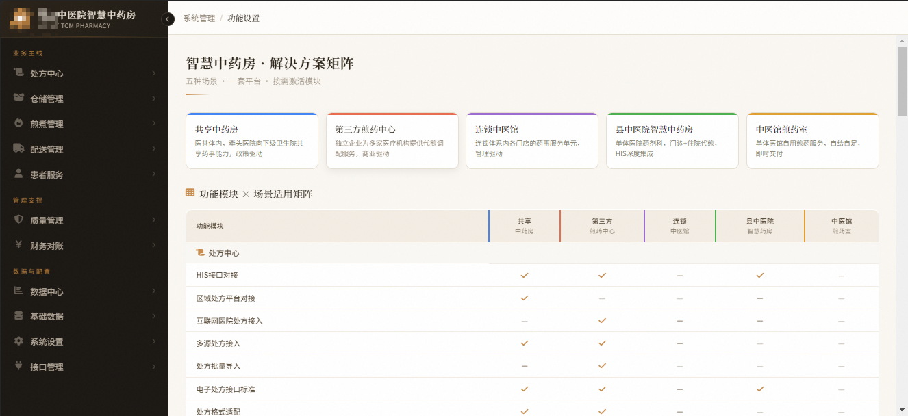

# OpenYGT-DMS Intelligent Decoction Management System

[中文](README.md) | English

[](LICENSE)
[]()
[]()
[]()
[]()

A full-process intelligent management system for traditional Chinese medicine (TCM) decoction scenarios, covering the complete chain from prescription receipt to patient medication pickup.

> Built-in IoT gateway, supporting mainstream decoction machines (requires device support for MQTT 3.1/3.1.1 protocol), packaging machines, and label printers via MQTT protocol, enabling real-time equipment status monitoring, fault alarms, and production statistics.

---

## 🚀 Demo

| Item | Address |
|------|---------|
| 🌐 Demo Site | https://demo.dms.openygt.org.cn |
| 💬 Demo Account | Contact `openygt` on WeChat for credentials |

> Demo data resets automatically at midnight. Contact `openygt` on WeChat to request a trial account.

### Feature Overview

| Module | Description |
|--------|-------------|
| 📋 Prescription Management | Full workflow: prescription entry, receipt, review, and circulation |
| 🏭 Production Command | Production dashboard, task assignment, process tracking, time monitoring |
| 🔧 Equipment Management | Equipment ledger, network monitoring, grouping, alarm center |
| ✅ Quality Inspection | Inspection records, sample retention, pass statistics |
| 📦 Dispensing Management | Temporary storage, dispensing confirmation, patient progress query |
| 🔍 Traceability Query | Prescription trace, batch trace, exception trace |
| 📱 PDA Operations | Mobile decoction operations and equipment identification |
| 🖨️ Print Center | Label printing, work order printing management |
| ⚙️ System Management | Users, roles, menus, permissions, parameter configuration |

---

## 📦 Quick Start

### Option 1: Docker One-Click Deployment (Recommended ⭐)

> For users who want to experience the system fastest, no need to install JDK, Node.js, or MySQL.
>
> Supports: Windows, macOS, Linux

**Prerequisites**
- [Docker](https://www.docker.com/products/docker-desktop) 24.0+ or compatible version
- [Docker Compose](https://docs.docker.com/compose/install/) 2.0+

**Installation Steps**

```bash
# 1. Clone the repository
git clone https://github.com/openygt/openygt-dms.git
cd openygt-dms

# 2. Set JWT secret (at least 32 random characters, cannot contain "Test")
export JWT_SECRET="YourRandomSecretKeyAtLeast32CharactersLong"

# 3. Start all services (MySQL + Redis + Backend + Frontend)
docker compose up -d

# 4. Wait for services to be ready (first startup takes about 60-90 seconds)
docker compose logs -f backend

# 5. Access the system
# Web Admin: http://localhost
# Default account: admin / admin123
```

> **Windows Users**: Replace `export` with `set JWT_SECRET=your_secret`

**Common Commands**

```bash
# Check service status
docker compose ps

# View logs
docker compose logs -f backend
docker compose logs -f frontend

# Stop services
docker compose down

# Full cleanup (including database data)
docker compose down -v
```

---

### Option 2: Source Installation

> For developers, users who need secondary customization, or those who want to deeply understand the system.

#### Prerequisites

| Component | Version | Download |
|-----------|---------|----------|
| JDK | 8+ | [Oracle](https://www.oracle.com/java/technologies/downloads/) / [OpenJDK](https://adoptium.net/) |
| Node.js | 18+ | [nodejs.org](https://nodejs.org/) |
| MySQL | 8.0+ | [mysql.com](https://dev.mysql.com/downloads/) |
| Redis | 7+ | [redis.io](https://redis.io/download/) |
| Maven | 3.8+ | [maven.apache.org](https://maven.apache.org/download.cgi) |

#### Step 1: Configure Backend

```bash
# 1. Clone the repository
git clone https://github.com/openygt/openygt-dms.git
cd openygt-dms

# 2. Copy example configuration file
cp dms-app/src/main/resources/application.yml.example \
   dms-app/src/main/resources/application.yml

# 3. Edit application.yml and modify the following configurations:
#    - spring.datasource.password: your MySQL password
#    - spring.redis.password: your Redis password (leave empty if none)
#    - jwt.secret: at least 32 random characters (cannot contain "Test")
```

#### Step 2: Create Database

```bash
# Create database using MySQL client
mysql -uroot -p -e "CREATE DATABASE openygt_dms CHARACTER SET utf8mb4 COLLATE utf8mb4_unicode_ci;"
```

#### Step 3: Start Backend

```bash
# Compile backend
mvn clean package -DskipTests

# Set environment variable and start
export JWT_SECRET="YourRandomSecretKeyAtLeast32CharactersLong"
java -jar dms-app/target/dms-app-1.0.0.jar --server.port=8080
```

After startup, Flyway will automatically run SQL scripts under `db/migration/` to create table structures.

> Seeing `Started DmsApplication` indicates successful startup.

#### Step 4: Import Demo Data (Optional)

```bash
# Import demo data for a complete experience
mysql -uroot -p openygt_dms < dms-app/src/main/resources/db/demo/init.sql
```

#### Step 5: Start Frontend

```bash
# Open a new terminal window
cd frontend
npm install
npm run dev
```

#### Step 6: Access the System

Open browser and visit: http://localhost:5173

Default account: `admin` / `admin123`

> **Windows Users**: Replace `export` with `set` in commands

---

## 🏗️ Project Structure

```
openygt-dms/
├── dms-analytics/          # Data analytics module
├── dms-app/                # Application entry point
│   └── src/main/resources/
│       ├── db/migration/   # Flyway database migration scripts
│       └── db/demo/        # Demo data
├── dms-common/             # Common module (utils, constants)
├── dms-equipment/          # Equipment management module
├── dms-inventory/          # Inventory management module
├── dms-iot-gateway/        # IoT gateway module
├── dms-masterdata/         # Master data module
├── dms-pda/                # PDA mobile terminal
├── dms-print/              # Print center module
├── dms-production/         # Production management module
├── dms-quality/            # Quality inspection module
├── dms-rbac/               # RBAC permission module
├── dms-system/             # System management module
├── frontend/               # Web frontend (Vue 3 + Vite)
│   └── src/
│       ├── api/            # API interfaces
│       ├── views/          # Page components
│       └── router/         # Route configuration
├── pda-uniapp/             # PDA mobile (uni-app)
├── docker-compose.yml      # Docker one-click deployment
├── Dockerfile.backend      # Backend image build
└── frontend/Dockerfile.frontend  # Frontend image build
```

---

## 🛠️ Tech Stack

| Layer | Technology | Version |
|-------|------------|---------|
| Frontend (Web) | Vue 3 + TypeScript + Element Plus | Vue 3.4 |
| Frontend (PDA) | uni-app (Vue 3) | uni-app 3.x / Vue 3.3+ |
| Backend | Spring Boot + MyBatis-Plus | Spring Boot 2.7.18 (upgrade to 3.x planned, see roadmap) |
| Database | MySQL | 8.0+ |
| Cache | Redis | 7+ |
| Messaging | MQTT | MQTT 3.1/3.1.1 |
| Build | Maven | 3.8+ |
| Deployment | Docker + Docker Compose | 24.0+ or compatible |

---

## 📖 Documentation

- **User Manual & Deployment Guide** → [openygt-docs](https://gitee.com/openygt/openygt-docs)
- **Online Reading** → https://openygt.org.cn/docs
- **Architecture Design** → [ARCHITECTURE.md](./ARCHITECTURE.md)

---

## 🏥 Success Stories

### Story 1: Shared TCM Pharmacy in a County Medical Community

> A county medical community built a shared TCM pharmacy serving 8 township health centers and 2 community health centers, processing 200-500 prescriptions daily. Solves the pain point of "multi-institution pharmaceutical capability sharing and grassroots delivery".

**System Interface**


**Core Function Modules (Level-2)**

- **Prescription Center**: Prescription intake, review, my prescriptions, agreement prescription management
- **Warehouse Management**: Supplier management, inbound, inventory, drug expiry management, outbound transfer, inventory check, returns, packaging material management
- **Decoction Management**: Decoction plan, production tasks, process records, equipment management
- **Delivery Management**: Logistics delivery, in-hospital dispensing, in-hospital delivery
- **Patient Service**: Prescription query, logistics query, WeChat official account, ticket/customer service
- **Quality Management**: Process quality control, complaint management, abnormal prescriptions, drug recall management
- **Financial Reconciliation**: Pricing, drug price adjustment, decoction fee management, reconciliation
- **Data Center**: Dashboard, statistics, reports
- **Master Data**: Institution personnel, drug management, training, labels, backend settings
- **System Settings**: Permissions, notifications, prescription prompts, default parameters
- **Interface Management**: Prescription, price, inventory, logistics, equipment interfaces

---

### Story 2: Smart TCM Pharmacy in a County Hospital

> A county hospital pharmacy department operates a smart TCM pharmacy handling outpatient and inpatient decoction services, processing 100-300 prescriptions daily with urgent decoction support. Solves the pain point of "large outpatient decoction volume, complex inpatient ward delivery process, occasional urgent decoction requiring rapid response".

**System Interface**



**Core Function Modules (Level-2)**

- **Prescription Management**: Outpatient prescription intake, inpatient order intake, HIS deep integration, pre-dispensing review, inpatient order review, agreement prescription management
- **Decoction Management**: Outpatient decoction, inpatient decoction, urgent decoction channel, decoction plan config, soaking/decoction/packaging process, equipment monitoring
- **Inpatient Delivery**: Ward nurse station delivery, per-bag delivery, full-batch delivery, delivery tracking
- **Drug Management**: Hospital drug committee catalog, outpatient/inpatient/center pharmacy unified inventory, drug matching, compatibility禁忌
- **Quality Management**: Full-process traceability (to ward/bed), temperature curve analysis, sample retention, process time alerts
- **Insurance Integration**: Insurance/DRG/DIP settlement, hospital unified billing, real-time fee sync
- **Equipment Management**: Decoction machine/packaging machine records, monitoring, maintenance plans
- **Report Statistics**: Workload reports, drug category reports, prescription bag reports, inpatient/outpatient decoction stats
- **Dashboard**: Dispensing dashboard, review dashboard, decoction dashboard, packaging dashboard, inpatient delivery dashboard
- **System Management**: User/permission, roles, notifications, prescription prompt rules

---

### Story 3: Third-Party Decoction Center in Heilongjiang

> A third-party decoction center in Heilongjiang providing decoction and dispensing services to multiple hospitals and clinics, processing 300-800 prescriptions daily covering full pipeline from order intake to delivery. Solves the pain point of "multi-client independent operations".

**System Interface**


**Core Function Modules (Level-2)**

- **Basic Config**: Organization, decoction plan, user & permission management
- **Client & Drugs**: Client management, factory/client drug management, drug matching, compatibility禁忌, agreement prescription
- **Procurement & Inventory**: Supplier management, purchase orders/review, warehouse, inbound/outbound, inventory check/alerts, loss reporting
- **Orders & Prescriptions**: Today/history orders, progress overview, exception handling, intake review, agreement query, recycle bin
- **Decoction Production**: Dispensing, review, soaking, decoction, packaging, delivery
- **Center Monitoring**: Machine management/monitoring, shelf management/stocking, dispensing
- **Logistics & Patients**: Logistics info, delivery records, patient info management
- **Business Operations**: Fee settings, billing/settlement/reconciliation
- **Quality Traceability**: Decoction record trace, sample retention, operation logs, client complaints
- **External Interfaces**: HIS integration, API management, interface logs, data sync status
- **Reports**: Drug category, prescription bags, workload, client orders, decoction efficiency, settlement reconciliation

---

### Story 4: Chain TCM Pharmacy in Anguo, Hebei

> A chain TCM brand with 8 stores sharing one decoction center, processing 100-400 prescriptions daily, supporting multi-store order aggregation and unified decoction with batch delivery by store. Solves the pain point of "multi-store pharmaceutical coordination and quality control unification".

**System Interface**


**Core Function Modules (Level-2)**

- **System Management**: Organization, decoction plan, prescription defaults, label design
- **User & Permissions**: User management, role/permission assignment
- **Equipment Management**: Decoction/packaging machine records, monitoring, maintenance plans
- **Store Management**: Multi-store order aggregation, store-independent reconciliation, batch delivery
- **Medical Institutions**: Partner hospital/clinic management, service agreements, client accounts
- **Patient Management**: Patient info, prescription history, medication traceability
- **Drug Management**: Factory/store drug management, inventory alerts, drug matching, compatibility禁忌
- **Agreement Prescription**: Agreement settings, version control, store sharing
- **Label Management**: Label templates, label design, barcode printing
- **Production Operations**: Order intake, review, dispensing, soaking, decoction, packaging, delivery
- **Alert Center**: Inventory alerts, compatibility禁忌 alerts, equipment anomaly alerts

---

### Story 5: Decoction Room in a TCM Clinic in Shijiazhuang, Hebei

> A private TCM clinic decoction room processing 20-50 prescriptions daily with 3 decoction machines, covering prescription entry, review, decoction, inventory, and full PDA workflow. Solves the pain point of "low-cost full-process management".

**System Interface**


**Core Function Modules (Level-2)**

- **Prescription Management**: Prescription entry, management, query, printing, review (unprinted), outsourced decoction query, outpatient self-decoction query
- **Decoction Management**: Review management, process simulation, decoction slip printing, status query/modification, soaking time settings, decoction plan, equipment management, big screen, statistics
- **Inventory Management**: Drug inbound registration/management/review, inventory query, outbound records, inventory check, inventory alerts, alert policies, raw drug info, inventory reports, drug profit accounting
- **System Management**: Full PDA workflow (dispensing, decoction, packaging, concentration, paste), user/permission, drug position management, backend config, monitoring equipment

---

## 📊 Comparison of Five Solutions

| Dimension | Shared TCM Pharmacy | County Hospital Smart Pharmacy | Third-Party Decoction Center | Chain TCM Pharmacy | TCM Clinic Decoction Room |
|:---|:---|:---|:---|:---|:---|
| **One Sentence** | Leading hospital shares pharmaceutical capabilities with grassroots health centers | County hospital internal pharmacy unit, outpatient + inpatient decoction, deep HIS integration | Independent enterprise providing decoction services to multiple medical institutions | Pharmacy service unit within chain stores (HQ-managed or store-managed) | Single clinic internal decoction service |
| **Organization** | Medical community · Administrative affiliation | Single hospital · Internal department (pharmacy) | Third-party · Commercial cooperation | Chain group · Enterprise management | Single institution · Internal department |
| **Service Target** | Grassroots members within medical community | Outpatients + inpatient wards of the hospital | Various contracted medical institutions | Chain brand stores and visiting patients | Clinic patients |
| **Core Driver** | Policy-driven: resource下沉, homogeneous management | Clinical-driven: pharmaceutical standardization, complex inpatient decoction process | Commercial-driven: market-oriented operations, multi-client competition | Management-driven: brand consistency, service standardization | Service-driven: self-sufficiency, immediate delivery |
| **Prescription Source** | Unified HIS within medical community | Hospital HIS (outpatient prescriptions + inpatient orders) | Multiple heterogeneous HIS/internet hospitals | Store-based physicians | Clinic physicians |
| **Prescription Review** | Licensed pharmacist unified review at leading hospital | Hospital pharmacy licensed pharmacist review (outpatient pre-review + inpatient order review) | Licensed pharmacist substantive review (compatibility, dosage, contraindications) | Store licensed pharmacist review; remote review must comply with local health commission policy requirements | Licensed pharmacist review if available; otherwise rely on HQ or third-party review services |
| **Drug Catalog** | Unified catalog within medical community | Hospital drug committee制定, fully integrated with HIS | Customized per client agreement | Chain HQ unified制定 | Clinic self-procurement |
| **Inventory** | Central pharmacy ↔ grassroots pharmacies, multi-institution linkage | One hospital one warehouse: outpatient + inpatient + central pharmacy | Multi-client inventory isolation, independent | HQ ↔ store transfer | One warehouse one pharmacy |
| **Decoction Capacity** | 200-500 prescriptions/day | 100-300 prescriptions/day, urgent decoction channel supported | 300-800 prescriptions/day, multi-formats supported | Store-managed: 1-2 units each; HQ-managed: multiple units centralized | 1-2 decoction machines, dozens of prescriptions/day |
| **Delivery** | To member institution pharmacy/health station (dispensed by member institution to patients), some support direct-to-patient | Outpatient: patient pickup/express; Inpatient: delivery to ward nurse station | To contracted institutions + third-party home delivery | To stores + express/errand home delivery | Patient pickup mainly, some provide delivery |
| **Settlement** | Internal medical community accounting + unified insurance payment | Hospital unified billing, deeply embedded with insurance/DRG/DIP | Multi-client ledger + independent billing | Internal enterprise cost allocation + patient self-pay | Internal clinic accounting |
| **Insurance** | Through leading hospital unified connection | Direct through hospital insurance system, most complete | Requires independent application or relies on client insurance | Mostly self-pay, some items insurance | Some items insurance |
| **Traceability** | Prescription → Patient (prescription ID, patient info, grassroots institution) | Prescription → Patient → Ward (prescription ID, patient info, ward/bed, decoction batch) | Prescription → Client Institution → Patient (prescription ID, client institution, patient info, decoction batch) | Prescription → Store → Patient (prescription ID, store, patient info) | Prescription → Patient (prescription ID, patient info) |
| **Regulation** | County Medical Community Drug Management Guidelines + local regulations | Medical Institution Drug Management Regulations + Hospital TCM Management Regulations (strictest) | Drug Administration Law + TCM Decoction Room Management Regulations + local regulations | Medical Institution Drug Management Regulations or TCM Clinic Management Measures (depending on qualification type) + internal QC system | Medical Institution Management Regulations + TCM Clinic Management Measures |
| **Staffing** | Licensed pharmacist + review pharmacist + dispenser + decoctionist + QC | Pharmacy director + review pharmacist + dispenser + decoctionist + QC (most complete) | Review pharmacist + dispenser + decoctionist + QC + customer service | Licensed pharmacist + dispenser + decoctionist (more concentrated under HQ-managed mode) | Licensed pharmacist + dispenser兼任decoctionist (1-2 people multitasking) |
| **Scale** | Large/Medium | Medium | Large/Medium | Small/Medium (store-managed) or Large/Medium (HQ-managed) | Micro |

---

## 🤝 Welcome to Cooperate

We are committed to partnering with TCM slice enterprises and TCM informatization enterprises to build an open and mutually beneficial industrial ecosystem. We sincerely invite partners from all sectors to join hands and explore the path of TCM digital transformation.

**Business Cooperation**: luobin@openygt.org.cn

## Solutions

| Solution | Repository | Description |
|:---|:---|:---|
| Technical Solution Library | [openygt-tcm-solution](https://gitee.com/openygt/openygt-tcm-solution) | Smart TCM hospital, medical community, grassroots capacity enhancement policy adaptation |
| Implementation & Acceptance | [openygt-tcm-delivery](https://gitee.com/openygt/openygt-tcm-delivery) | Implementation methodology, acceptance response templates, lessons learned |

---
## 🤝 Contributing

Issues and Pull Requests are welcome!

- Please read [CONTRIBUTING.md](./CONTRIBUTING.md) before submitting
- PRs require signing [CLA.md](./CLA.md)
- Follow [Conventional Commits](https://www.conventionalcommits.org/) specification

---

## 📜 License

OpenYGT-DMS adopts a **dual-license model**:

| Version | License | Applicable Scenario |
|---------|---------|---------------------|
| Open Source | [AGPL-3.0](LICENSE) | Free to use. If providing SaaS/cloud services to third parties based on this system, modified code must be open-sourced |
| Commercial | [Commercial License](LICENSE.commercial.md) | Medical institution closed-source deployment, exempt from open-source obligations |

### How to Choose a License?

| Your Scenario | Applicable License | Cost |
|:---|:---|:---|
| Learning/Research/Testing | AGPL-3.0 (Open Source) | Free |
| Self-deployment with willingness to open-source modifications | AGPL-3.0 (Open Source) | Free |
| SaaS with willingness to open-source modifications | AGPL-3.0 (Open Source) | Free |
| Medical institution closed-source deployment, not disclosing modified code | Commercial License | Contact luobin@openygt.org.cn |
| Uncertain | Contact us | — |

> For commercial licensing, please contact: luobin@openygt.org.cn

---

## 💬 Community & Support

| Channel | Scenario |
|---------|----------|
| 🐛 [Gitee Issues](https://gitee.com/openygt/openygt-dms/issues) | Bug reports, feature suggestions |
| 💬 WeChat `openygt` | Daily communication, questions |

---

## 🗺️ Document Navigation

| Document | Repository | Description |
|:---|:---|:---|
| [User Manual](https://openygt.org.cn/docs) | [openygt-docs](https://gitee.com/openygt/openygt-docs) | Installation, deployment, feature operation guide |
| [Architecture Design](./ARCHITECTURE.md) | This repo | System architecture, module description, technology selection |
| [Technical Solutions](https://gitee.com/openygt/openygt-tcm-solution) | openygt-tcm-solution | Smart TCM hospital, medical community, grassroots policy adaptation |
| [Implementation & Acceptance](https://gitee.com/openygt/openygt-tcm-delivery) | openygt-tcm-delivery | Implementation methodology, acceptance templates, lessons learned |
| [Changelog](./CHANGELOG.md) | This repo | Version change records |
| [Contributing Guide](./CONTRIBUTING.md) | This repo | How to participate in development |

---

<p align="center">
  <sub>Copyright © 2026 OpenYGT Contributors & Shanghai Zhoufang Intelligent Technology Co., Ltd.</sub>
</p>
